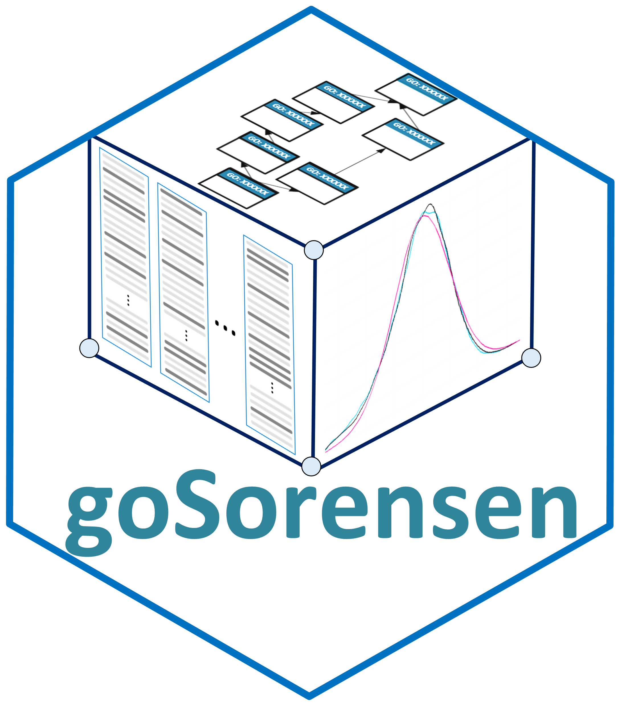
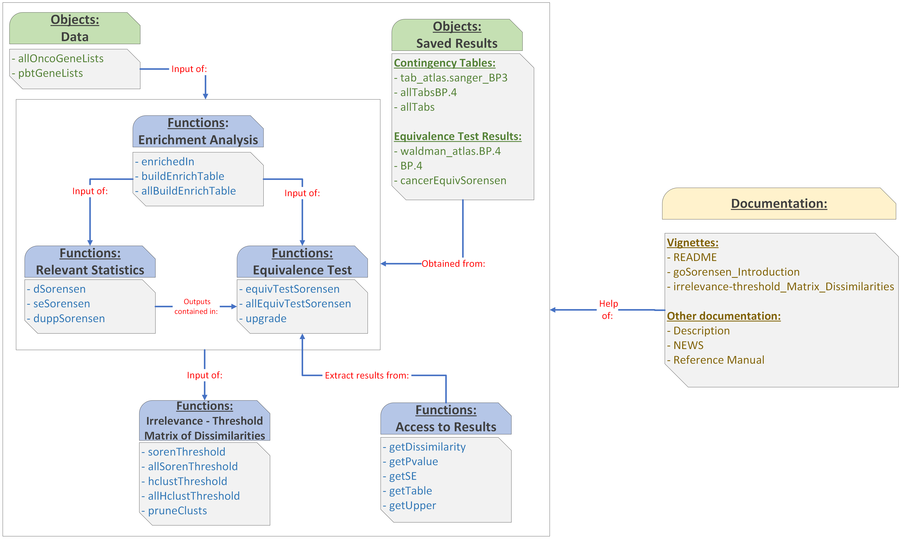

{width=25% align=center}

## Introduction

This R package implements inferential methods to compare gene lists (proving equivalence) in terms of their biological significance as expressed in the Gene Ontology GO. The compared gene lists are characterized by cross-tabulation frequency tables of enriched GO terms. Dissimilarity between gene lists is evaluated using the Sorensen-Dice dissimilarity.
The fundamental guiding principle is that two gene lists are taken as similar if they share a significant proportion of common enriched GO terms.

This inferential method, is developed and explained in the paper *An equivalence test between features lists, based on the Sorensen-Dice index and the joint frequencies of GO term enrichment*, available online in <https://rdcu.be/cOISz>

## goSorensen Functions and Objects.

`goSorensen` package provides the following functions:

- `enrichedIn`: Build a cross-tabulation of enriched and non-enriched GO terms vs. gene lists.
- `buildEnrichTable`: Build an enrichment contingency table from two or more gene lists.
- `allBuildEnrichTable`:  Iterate `buildEnrichTable` along the specified GO ontologies and GO levels
- `nice2x2Table`:  Check for validity an enrichment contingency table}
- `dSorensen`:  Compute the Sorensen-Dice dissimilarity
- `seSorensen`:  Standard error estimate of the sample Sorensen-Dice dissimilarity
- `duppSorensen`:  Upper limit of a one-sided confidence interval (0,dUpp] for the population dissimilarity
- `equivTestSorensen`:  Equivalence test between two gene lists, based on the Sorensen-Dice dissimilarity
- `allEquivTestSorensen`:  Iterate `equivTestSorensen` along GO ontologies and GO levels
- `getDissimilarity`, `getPvalue`, `getSE`, `getTable`, `getUpper`, `getNboot`, `getEffNboot`:  Accessor functions to some fields of an equivalence test result
- `upgrade`:  Updating the result of an equivalence test, e.g., changing the equivalence limit.
- `sorenThreshold`: For a given level (2, 3, ...) in a GO ontology (BP, MF or CC), compute the equivalence threshold dissimilarity matrix.
- `allSorenThreshold`:  Iterate `sorenThreshold` along the specified GO ontologies and GO levels.
- `hclustThreshold`:  From a Sorensen-Dice threshold dissimilarity matrix, generate an object of class "hclust"
- `allHclustThreshold`:  Iterate `hclustThreshold` along the specified GO ontologies and GO levels.
- `pruneClusts`:  Remove all NULL or non-representable as a dendrogram "equivClustSorensen" elements in an object of class "equivClustSorensenList".

`goSorensen` package provides the following objects:

- `allOncoGeneLists`: (Dataset) 7 gene lists possibly related with cancer
- `pbtGeneLists`: (Dataset) 14 gene lists possibly related with kidney transplant rejection
- `tab_atlas.sanger_BP3`: (Result) Contingency table of enriched GO terms at level 3 of ontology BP in two gene lists.
- `allTabsBP.4`: (Result) Contingency table of enriched GO terms at level 4 of ontology BP in all the possible combinations of lists from `allOncoGeneLists`.
- `allTabs`: (Result) Contingency table of enriched GO terms at level 3 to 10 of all the ontologies (BP, CC, MF) in all the possible combinations of lists from `allOncoGeneLists`.
- `waldman_atlas.BP.4`: (Result) Equivalence test results at level 4 of ontology BP in two gene lists.
- `BP.4`: (Result) Equivalence test results at level 4 of ontology BP in all the possible combinations of lists from `allOncoGeneLists`.
- `cancerEquivSorensen`: (Result) Equivalence test results at level 3 to 10 of all the ontologies (BP, CC, MF) in all the possible combinations of lists from `allOncoGeneLists`.

The following graph illustrates the structure and relationship between the functions, objects and documentation contained in goSorensen.

{width=100% align=center}

## Installation Instructions

`goSorensen` package must be installed with a working R version (>=4.3). Installation could take a few minutes on a regular desktop or laptop. Package can be installed from Bioconductor as follows:

```
if (!requireNamespace("goSorensen", quietly = TRUE)) {
    BiocManager::install("goSorensen")
}
library(goSorensen)
```

### Previous Genomic Annotation Packages.

Before using `goSorensen`, the user must have adequate knowledge of the species they intend to focus their analysis. The genomic annotation packages available in Bioconductor provide all the essential information about these species. For instance, if the research involves mice, the user must install and activate the annotation package `org.Mm.eg.db` as follows: 

```
if (!requireNamespace("org.Mm.eg.db", quietly = TRUE)) {
    BiocManager::install("org.Mm.eg.db")
    }
```
Other species may include:

- `org.Hs.eg.db`: Genome wide annotation for Humans.
- `org.At.tair.db`: Genome wide annotation for Arabidopsis
- `org.Ag.eg.db`: Genome wide annotation for Anopheles
- `org.Bt.eg.db`: Genome wide annotation for Bovine
- `org.Ce.eg.db`: Genome wide annotation for Worm
- `org.Cf.eg.db`: Genome wide annotation for Canine
- `org.Dm.eg.db`: Genome wide annotation for Fly
- `org.EcSakai.eg.db`: Genome wide annotation for E coli strain Sakai
- `org.EcK12.eg.db`: Genome wide annotation for E coli strain K12
- `org.Dr.eg.db`: Genome wide annotation for Zebrafish
- `org.Gg.eg.db`: Genome wide annotation for Chicken
- `org.Mm.eg.db`: Genome wide annotation for Mouse
- `org.Mmu.eg.db`: Genome wide annotation for Rhesus
- etc...

Due to the extensive research conducted on the human species and the examples documented in `goSorensen` about this species, the installation of the `goSorensen` package automatically includes the annotation package `org.Hs.eg.db` as a dependency. Therefore, there is no need to install it previously. The user must install the appropriate package to use genomic annotation for other species. 


The `goSorensen` functions require genome annotation via the `orgPackg` argument to annotate genes in GO terms for enrichment analysis. For example, the enrichment contingency table can be computed using the `buildEnrichTable` function.

```
buildEnrichTable(..., orgPackg = "org.Mm.eg.db")
```

### Gene Identifiers

`goSorensen` functions, such as `buidEnrichTable`, that entail identifying annotations in a GO term, which are essential for determining enrichment, require the user to provide, in the argument `geneUniverse`, a vector containing the identifiers of the universe of genes (wide genome) of the species being analysed. These gene identifiers can be readily obtained from the above-mentioned genomic annotation packages through the function `keys`. For instance, one can acquire the ENTREZ identifiers for the universe of genes in mice as follows: 

```
# Load the package:
library(org.Mm.eg.db)

# Obtain the IDs:
mouseEntrezIDs <- keys(org.Mm.eg.db, keytype = "ENTREZID")
```

Or, for the human species, as follows:

```
# Load the package:
library(org.Hs.eg.db)

# Obtain the IDs:
humanEntrezIDs <- keys(org.Hs.eg.db, keytype = "ENTREZID")
```
And in this way, for any other species


Then, one can use this object in the `geneUniverse` argument in whatever `goSorensen` function (e.g., `buidEnrichTable`) is needed:

```
buildEnrichTable(..., orgPackg = "org.Mm.eg.db", geneUniverse = mouseEntrezIDs)
```


## Contribution Guidelines
Contributions are welcome, if you wish to contribute or give ideas to improve the package, please you can contact with maintainer (Pablo Flores) to the address `p_flores@espoch.edu.ec`, and we can discuss your suggestion.

## References
<div id="refs" class="references">
<div id="goSorensen">

Flores, P., Salicru, M., Sanchez-Pla, A., & Ocana, J. (2022). An equivalence test between features lists, based on the Sorensen-Dice index and the joint frequencies of GO term enrichment. BMC bioinformatics, 23(1), 1-21.

</div>
</div>


